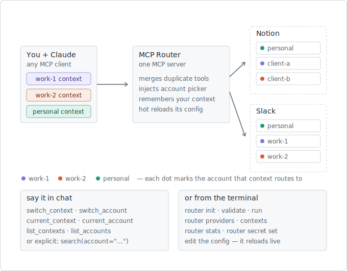

# MCP Router

> One MCP server. Unlimited accounts. *(working title — see naming note below)*

MCP Router is a local-first, open-source MCP server that sits between an AI
client (Claude Desktop, Cursor, …) and your other MCP servers, and solves one
problem exceptionally well: **multiple accounts per provider** — three Notion
workspaces, two GitHub identities, several Slack teams — through a single
MCP endpoint, with account selection that feels native to the model.



**In plain terms:** AI tools like Claude can connect to apps such as Notion or
Slack, but each connection only knows about one account — and most people
have several. Two jobs, a client, a personal life. Instead of installing the
same connector three times and drowning in duplicate tools, you install the
router once and tell it about all your accounts. To the AI it looks like a
single, ordinary connection; behind the scenes the router quietly holds one
connection per account and delivers each request to the right one. You choose
where things go the way you'd tell a colleague — "use my work-1 stuff for
now", "actually, search my personal Notion" — or group whole setups into
contexts, so switching from work-1 to personal flips Notion, Slack, and
everything else in one move. Every reply says which account it used, so
nothing lands in the wrong workspace silently, and adding a new account is
just a few lines in a config file — the running router picks it up the moment
you save.

## Works with any MCP client

The router speaks plain, standards-track MCP on both sides — there is nothing
Claude-specific in the contract (a deliberate constraint; see
[ADR-012](docs/adr/012-mcp-spec-evolution.md)). The `account` parameter is
ordinary JSON Schema, the "which account?" prompt is an ordinary text result,
and `switch_account`/`switch_context` are ordinary tools. Claude Desktop,
Cursor, Windsurf, Zed, VS Code, or a homegrown agent on any model can all sit
upstream. Two qualifiers: the *experience* scales with the model (reading the
enum, obeying the ask-message, and fanning out across accounts are model
behaviors — weaker models just get asked more often), and each client has its
own ritual for registering a local stdio server.

## Design philosophy

> Invisible plumbing, visible decisions. The router presents the model with a
> single coherent identity layer; the machinery stays hidden, but which
> account a request was routed to — especially a write — is always visible.

## Status

**v0.2.** v0.1 was validated in production (Claude Desktop, three live Notion
workspaces — see the ADR-003 validation note). Architecture is recorded in
[docs/adr](docs/adr/README.md) — start with
[ADR-000](docs/adr/000-design-philosophy.md) and the index.

```sh
npm install && npm run build
node dist/cli/index.js init       # writes ~/.config/mcp-router/config.yaml
node dist/cli/index.js validate
node dist/cli/index.js run        # speaks MCP on stdio
node dist/cli/index.js stats      # metrics snapshot of the running router
npm test                          # 40 tests incl. InMemoryTransport e2e
```

Working today: config schema + validation, downstream stdio/HTTP clients with
graceful per-account failure, tool merging with the injected `account` enum,
the five-step route resolver (explicit > sticky > context > singleton > ask),
account markers on implicit routes, `switch_account`/`current_account` sticky
defaults, cross-provider contexts (`switch_context`/`current_context`/
`list_contexts`), config hot reload (save the file — changed accounts
reconnect and the tool list updates live; a broken save keeps the last known
good config), auth-aware account health in `list_accounts`, `router stats`
(persisted metrics snapshot), `router providers|accounts|contexts`,
`router init --import` from `claude_desktop_config.json`, and
`router secret set/rm` (OS keychain, hidden input).

Milestones:

- **v0.1** (shipped) — multiple accounts, one provider; merged virtual tools;
  explicit `account` parameter; `router init|validate|run`.
- **v0.2** (shipped) — sticky active account, per-account call health,
  `router stats`.
- **v0.3** (this) — cross-provider contexts surfaced as tools; config hot
  reload; expanded CLI.
- **Next** — Streamable HTTP upstream (per-session state via
  `Mcp-Session-Id`, URL-based client wiring).

Naming: "MCP Router" describes the mechanism, not the concept; a rename is
deliberately deferred until pre-v1 (cheap then, a distraction now).
